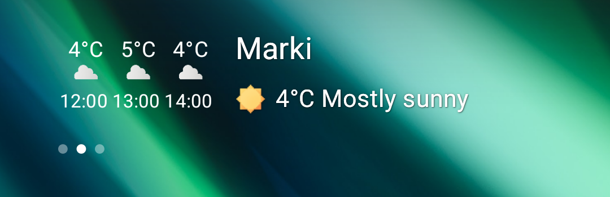
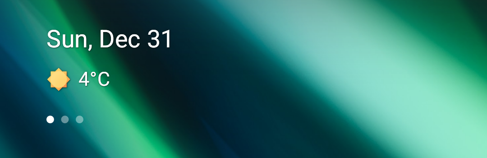

# Generic Weather Plugin

This plugin shows weather information from apps supporting GenericWeather protocol.

Information about configuration and supported apps can be found [here](https://gadgetbridge.org/basics/integrations/weather/).

# Features:
|     target      | description                                 | is customisable |
|:---------------:|---------------------------------------------|:---------------:|
| Forecast target | Shows current condition and hourly forecast |        ✅        |

|          complication          | description                                | is customisable |
|:------------------------------:|--------------------------------------------|:---------------:|
| Current condition complication | Shows current condition (icon and/or text) |        ✅        |
| Sunrise / sunset complication  | Shows time of next sunrise / sunset        |        ❌        |

| Screenshots                                                                                                                              |
|------------------------------------------------------------------------------------------------------------------------------------------|
|  |
|                         |
|                                      |