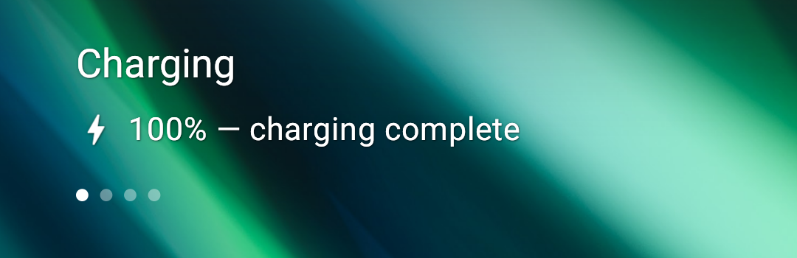

# Local Battery Plugin

This plugin shows charging information when device is connected to power.

# Features:
|        target        | description                | is customisable |
|:--------------------:|----------------------------|:---------------:|
| Charging info target | Shows charging information |        ✅        |

| Screenshots                                                                                     |
|-------------------------------------------------------------------------------------------------|
|       |
|       |
|                            |
