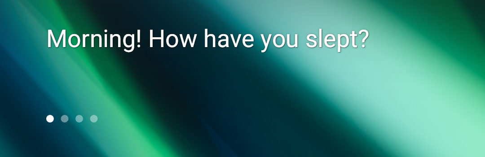

# Sleep as Android Plugin

Shows sleep messages sent out by [Sleep as Android](https://sleep.urbandroid.org/).

Graphics provided by Sleep as Android team.

# Features:
|        target         | description                                                                     | is customisable |
|:---------------------:|---------------------------------------------------------------------------------|:---------------:|
| Sleep messages target | Shows sleep messages from [Sleep as Android](https://sleep.urbandroid.org/) app |        ✅        |

| Screenshots                                                                          |
|--------------------------------------------------------------------------------------|
|  |
|                    |
|  |
|                  |
